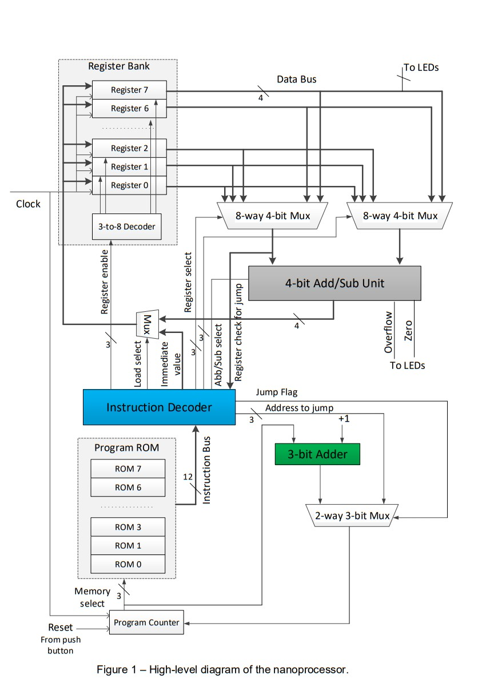

# Nano-processor
# Introduction
We will design a very simple microprocessor (hence, called a nanoprocessor) capable of executing a simple set of instructions. Block diagram of the nanoprocessor is given in Fig. 1. Set of instructions supported by the nanoprocessor is given in Table 1. 

